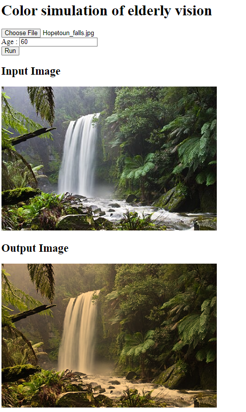

# Simulate what color the elderlies see

https://konbraphat51.github.io/ElderVisionSimulation/

(Image from: [Wikipedia](https://ja.wikipedia.org/wiki/%E8%87%AA%E7%84%B6))

It is said that elderlies' vision "get yellow" somehow. Don't ask me why.

For creating an elderly-friendly interface, I wish this tool helps

## Method

used the all the maths and data in section 2 in [Ikeda & Narita (2008)](https://www.jstage.jst.go.jp/article/itej/62/7/62_7_1110/_pdf/-char/ja)

## data

- color matching function: https://cie.co.at/datatable/cie-1931-colour-matching-functions-2-degree-observer

- optical density: https://www.semanticscholar.org/paper/Aging-of-the-human-lens.-Pokorny-Smith/a253cc944697713ba8dbce30cbddbf7b27d67c7f

## Reference

- K. Ikeda, N. Narita, "加齢を考慮した情報画面の配色評価・補正支援装置 (Evaluation and Correction Support System of Color Schemes for Data Contents Considering Aging of Crystalline Lens)," 映像メディア学会誌, Vol. 62, No. 7, 2008

  - I used the most math from here

- S. Yamauchi, H. Aoyama, T. Oya "視覚において高齢者に優しい製品開発のための視覚シミュレーションシステム (Vision Simulation System for Development of Vision-Friendly Products for Elderly Persons)," 日本機械学会論文集, Vol. 79, No. 800, 2013
